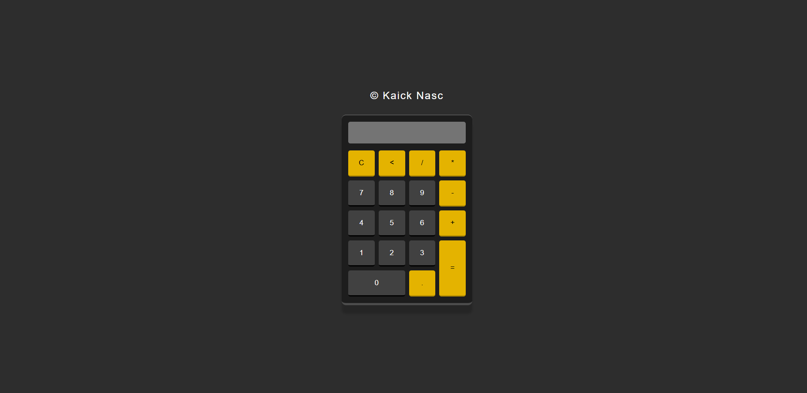

<h1><a href="https://kaicknasc.github.io/Calculator-js/">See the site</a> 👈🏾</h1>

 ## 🧮 Calculator Project

A fully functional calculator web application built using HTML, CSS, and JavaScript.
This project demonstrates core front-end development skills such as DOM manipulation, event handling, and responsive design.

 ## ✨ Features

➕ Basic operations: addition, subtraction, multiplication, and division

 - 🧹 Clear and delete functions

 - 📱 Responsive layout (works on desktop and mobile)

 - 🎨 Simple and modern user interface

 - ⚡ Fast and lightweight

 ## 🛠️ Technologies Used

 - HTML5 → Structure and elements

 - CSS3 → Styling and responsive design

 - JavaScript (ES6) → Logic and interactivity

 ## 📸 Preview

 

 ## 🤝 Contributing

Contributions, issues, and feature requests are welcome!
Feel free to fork this repo and submit a pull request.

 ## 📜 License

 This project is under the MIT License. See the file [LICENSE](https://mit-license.org/) for more details.

 ## 👨‍💻 Author

Developed with ❤️ by **KaickNasc**